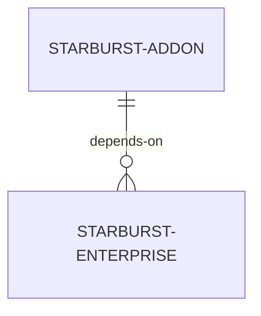
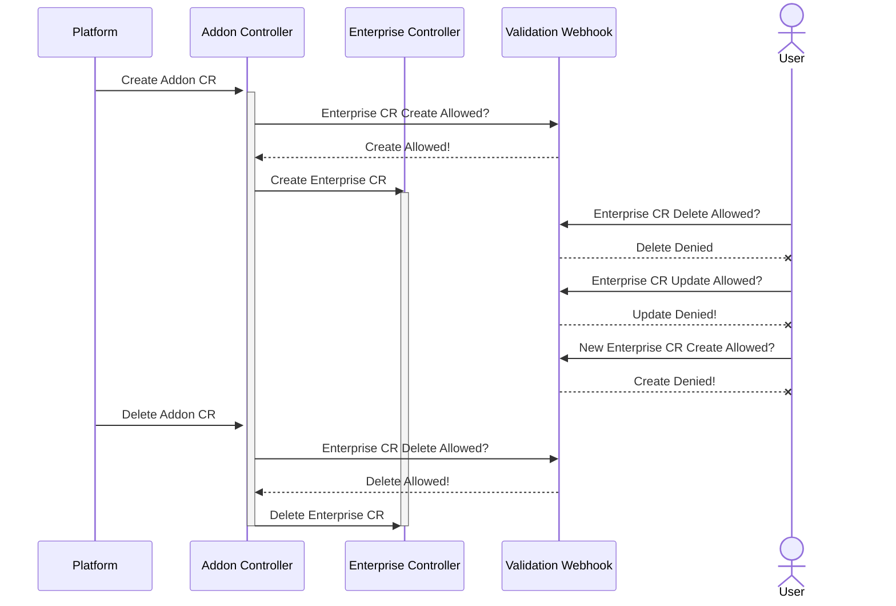

# Starburst Addon Controller New Design POC

**TL/DR** Instructions for running this POC are [here](/docs/run-poc.md), cloning is not required.

[Sequence Diagram Quick Access](#sequence-diagram)

## Prologue

This repository holds the sources for a POC demonstrating a new design for our [Starburst Controller](https://github.com/RHEcosystemAppEng/starburstaddon-operator). 
The new design leverages *OLM* dependencies mechanism for requiring the *Starburst Enterprise* package. 
A *Dynamic Admission Webhook* for provisioning *StarburstEnterprise* CR modifications. 
And a *Finalizer* for cleaning up the *StarburstEnterprise* CR.

## Repository content

Next to this document, you'll find two operators with their respective bundle manifests (deployed to *quay.io*).

The [starburst-enterprise](/starburst-enterprise) controller is a dummy controller, created from the basic initialized template, and serves as a *placeholder* for the actual controller.

The [starburst-addon](/starburst-addon) controller is the shell for the new design, this part will be implemented in our current operator, if this design gets accepted.

The [olm-catalog](/olm-catalog) folder holds the sources for the OLM catalog referencing both packages.

The [docs](/docs) folder holds documentation for running this POC, as well as building it from scratch.

> This POC is demonstrating the usage of webhooks, dependencies, and finalizers, it doesn't hold the code for our current operator.

## Design walkthrough

The *starburst-addon* describes the *starburst-enterprise* package as its dependency and runs 2 controllers. 
The *addon* controller creates the *StarburstEnterprise* CR. 
The *webhook* controller provisions all *StarburstEnterprise* CRs. 
The *addon* controller leverages a *finalizer* for cleaning up existing *StarburstEnterprise* CRs.

In this design, the *addon* controller will handle the actions currently handled by our operator. 
Reconciling the required resources, i.e. secrets, prometheus servers, and service monitors. 
And eventually deploying the required *StarburstEnterprise* CR.

The *webhook*, makes our current running *cronjob* redundant by intercepting all API requests for creating/patching/deleting *StarburstEnterprise* CRs. 
Prohibiting any modifications to our CR.

## Entity Relationship

## Sequence Diagram

